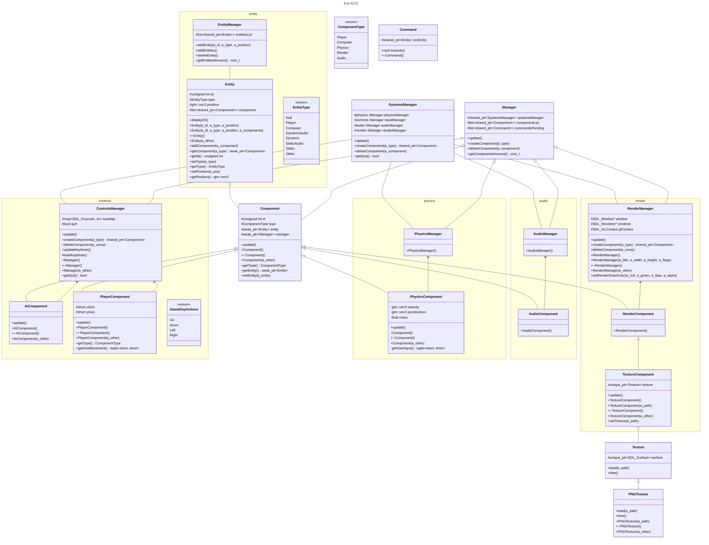

```mermaid
---
title: Eon ECS
---
classDiagram
	SystemsManager -- PhysicsManager
	SystemsManager -- AudioManager
	SystemsManager -- RenderManager
	SystemsManager -- ControlsManager
	EntityManager -- Entity

	Texture <|-- PNGTexture

	Component <|-- AIComponent
	Component <|-- PlayerComponent
	Component <|-- AudioComponent
	Component <|-- PhysicsComponent
	Component <|-- RenderComponent
	RenderComponent <|-- TextureComponent

	Manager <|-- ControlsManager
	Manager <|-- AudioManager
	Manager <|-- PhysicsManager
	Manager <|-- RenderManager

	ControlsManager <-- PlayerComponent
	ControlsManager <-- AIComponent
	PhysicsManager <-- PhysicsComponent
	AudioManager <-- AudioComponent
	RenderManager <-- RenderComponent

	TextureComponent o-- Texture

	Entity o-- Component
	Manager o-- Component

class SystemsManager {
	#physics::Manager physicsManager
	#controls::Manager inputManager	
	#audio::Manager audioManager
	#render::Manager renderManager

	+update()
	+createComponent(a_type) shared_ptr~Component~
	+deleteComponent(a_component)
	+getQuit() bool
}

class ComponentType {
	<<enum>>
	Player
	Computer
	Physics
	Render
	Audio
}

class Component {
	#unsigned int id
	#ComponentType type
	#weak_ptr~Entity~ entity
	#weak_ptr~Manager~ manager

	+update()*

	+Component()
	+~Component()*
	+Component(a_other)

	+getType() ComponentType
	+getEntity() weak_ptr~Entity~
	+setEntity(a_entity)
}

class Manager {
	#shared_ptr~SystemsManager~ systemsManager
	#list~shared_ptr~Component~~ componentList
	#list~shared_ptr~Command~~ commandsPending

	+update()
	+createComponent(a_type)*
	+deleteComponent(a_component)*

	+getComponentsAmount() size_t
}

class Command {
	#shared_ptr~Entity~ srcEntity

	+void execute()*

	+~Command()*
}

class Texture {
	#unique_ptr~SDL_Surface~ surface
	
	+load(a_path)*
	+free()*
}

class PNGTexture {
	+load(a_path)
	+free()

	+PNGTexture(a_path)
	+~PNGTexture()
	+PNGTexture(a_other)
}

namespace entity {
	class EntityType {
		<<enum>>
		Null
		Player
		Computer
		DynamicAudio
		Dynamic
		StaticAudio
		Static
		Other
	}
	
	class Entity {
		#unsigned int id
		#EntityType type
		#glm::vec3 position
		#list~shared_ptr~Component~~ component
		
		+displayID()
		
		+Entity(a_id, a_type, a_position)
		+Entity(a_id, a_type, a_position, a_components)
		+~Entity()
		+Entity(a_other)
		
		+addComponent(a_component)
		+getComponent(a_type) weak_ptr~Component~
		+getId() unsigned int
		+setType(a_type)
		+getType() EntityType
		+setPosition(a_pos)
		+getPosition() glm::vec3
	}

	class EntityManager {
		#list~shared_ptr~Entity~~ entitiesList

		+addEntity(a_id, a_type, a_position)
		+addEntities()
		+deleteEntity()

		+getEntitiesAmount() size_t
	}
}

namespace controls {
	class GameKeyActions {
		<<enum>>
		Up
		Down
		Left
		Right
	}
	 
	class PlayerComponent {
		#short xAxis
		#short yAxis

		+update()
		
		+PlayerComponent()
		+~PlayerComponent()
		+PlayerComponent(a_other)

		+getType() ComponentType
		+getAxisMovement() tuple~short, short~
	}

	class AIComponent {
		+update()

		+AIComponent()
		+~AIComponent()
		+AIComponent(a_other)
	}

	class ControlsManager {
		#map~SDL_Keycode, int~ keyMap
		#bool quit
		
		+update()
		+createComponent(a_type) shared_ptr~Component~
		+deleteComponent(a_comp)
		+updateKeybinds()
		#loadKeybinds()
		
		+Manager()
		+~Manager()
		+Manager(a_other)

		+getQuit() bool
	}
}

namespace physics {
	class PhysicsComponent {
		-glm::vec3 velocity
		-glm::vec3 acceleration
		-float mass

		+update()
		
		+Component()
		+~Component()
		+Component(a_other)
		
		-getUserInput() tuple~short, short~
	}

	class PhysicsManager {
		+PhysicsManager()
	}
}

namespace audio {
	class AudioComponent {
		+AudioComponent()
	}
	
	class AudioManager {
		+AudioManager()
	}
}

namespace render {
	class RenderComponent {
		+RenderComponent()
	}

	class TextureComponent {
		#unique_ptr~Texture~ texture
		
		+update()
		
		+TextureComponent()
		+TextureComponent(a_path)
		+~TextureComponent()
		+TextureComponent(a_other)

		+setTexture(a_path)
	}
	
	class RenderManager {
		#SDL_Window* window
		#SDL_Renderer* renderer
		#SDL_GLContext glContext

		+update()
		+createComponent(a_type) shared_ptr~Component~
		+deleteComponent(a_comp)
		
		+RenderManager()
		+RenderManager(a_title, a_width, a_height, a_flags)
		+~RenderManager()
		+RenderManager(a_other)

		+setRenderDrawColor(a_red, a_green, a_blue, a_alpha)
	}
}
```
