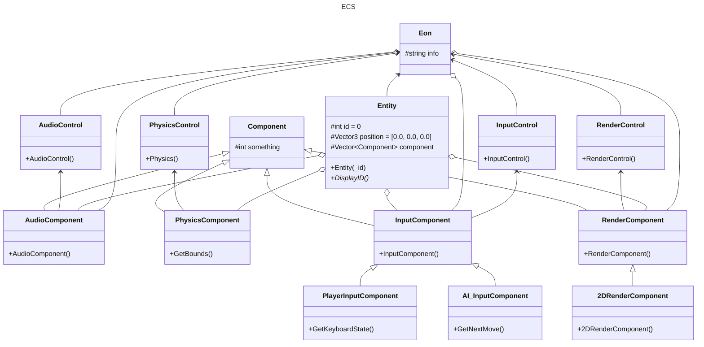

```mermaid
---
title: ECS
---
classDiagram
	Eon <-- Entity
	Eon <-- PhysicsControl
	Eon <-- AudioControl
	Eon <-- RenderControl
	Eon <-- InputControl
	Component <|-- AudioComponent
	Component <|-- PhysicsComponent
	Component <|-- RenderComponent
	Component <|-- InputComponent
	PhysicsControl <-- PhysicsComponent
	AudioControl <-- AudioComponent
	RenderControl <-- RenderComponent
	Entity o-- InputComponent
	Eon o-- InputComponent
	InputComponent <|-- PlayerInputComponent
	InputComponent <|-- AI_InputComponent
	InputControl <-- InputComponent
	Entity o-- RenderComponent
	Eon o-- RenderComponent
	RenderComponent <|-- 2DRenderComponent
	Entity o-- AudioComponent
	Eon o-- AudioComponent
	Entity o-- PhysicsComponent
	
class Eon {
	#string info
}

class Component {
	#int something
}

class Entity {
	#int id = 0
	#Vector3 position = [0.0, 0.0, 0.0]
	#Vector~Component~ component
	+Entity(_id) 
	+DisplayID()*
}

class InputControl {
	+InputControl()
}

class InputComponent {
	+InputComponent()
}

class PlayerInputComponent {
	+GetKeyboardState()
}

class AI_InputComponent {
	+GetNextMove()
}

class PhysicsComponent {
	+GetBounds()
}

class PhysicsControl {
	+Physics()
}

class AudioControl {
	+AudioControl()
}

class AudioComponent {
	+AudioComponent()
}

class RenderControl {
	+RenderControl()
}

class RenderComponent {
	+RenderComponent()
}

class 2DRenderComponent {
	+2DRenderComponent()
}
```
