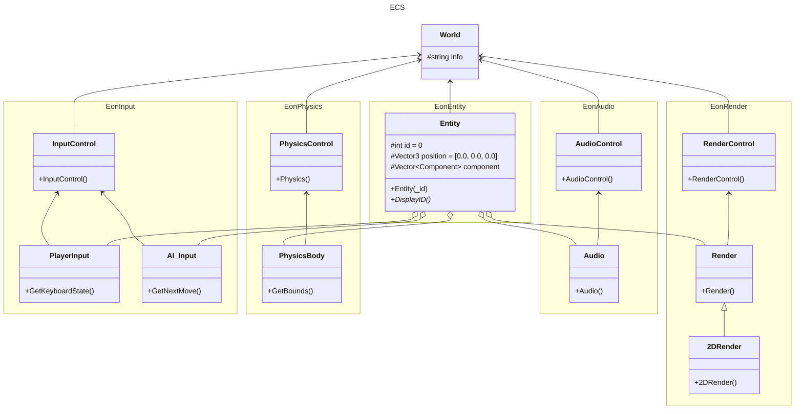

```mermaid
---
title: ECS
---
classDiagram
	World <-- Entity
	World <-- PhysicsControl
	World <-- AudioControl
	World <-- RenderControl
	World <-- InputControl
	PhysicsControl <-- PhysicsBody
	AudioControl <-- Audio
	RenderControl <-- Render
	Entity o-- PlayerInput
	Entity o-- AI_Input
	InputControl <-- PlayerInput
	InputControl <-- AI_Input
	Entity o-- Render
	Render <|-- 2DRender
	Entity o-- Audio
	Entity o-- PhysicsBody
	
class World {
	#string info
}

namespace EonEntity {
	class Entity {
		#int id = 0
		#Vector3 position = [0.0, 0.0, 0.0]
		#Vector~Component~ component
		+Entity(_id) 
		+DisplayID()*
	}
}

namespace EonInput {
	class InputControl {
		+InputControl()
	}
	class PlayerInput {
		+GetKeyboardState()
	}

	class AI_Input {
		+GetNextMove()
	}
}

namespace EonPhysics {
	class PhysicsBody {
		+GetBounds()
	}
	
	class PhysicsControl {
		+Physics()
	}
}

namespace EonAudio {
	class AudioControl {
		+AudioControl()
	}
	
	class Audio {
		+Audio()
	}
}

namespace EonRender {
	class RenderControl {
		+RenderControl()
	}
	
	class Render {
		+Render()
	}
	
	class 2DRender {
		+2DRender()
	}
}
```
