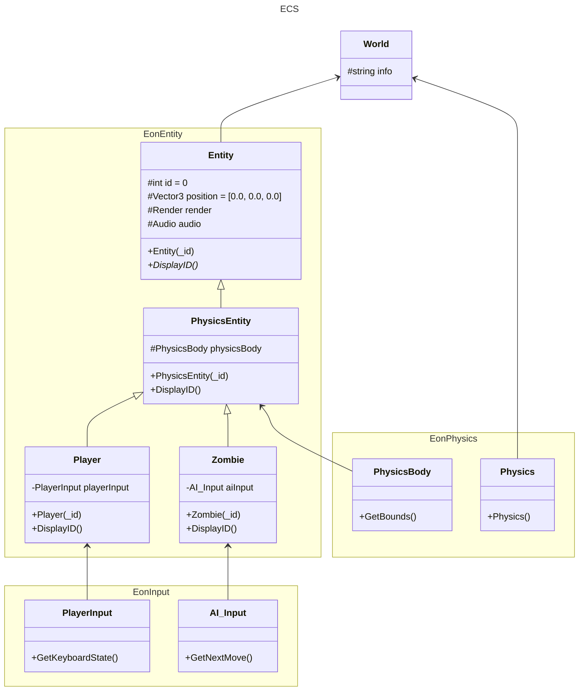

```mermaid
---
title: ECS
---
classDiagram
	World <-- Entity
	World <-- Physics
	Entity <|-- PhysicsEntity
	PhysicsEntity <|-- Player
	PhysicsEntity <|-- Zombie
	PhysicsEntity <-- PhysicsBody
	Player <-- PlayerInput
	Zombie <-- AI_Input


class World {
	#string info
}

namespace EonEntity {
	class Entity {
		#int id = 0
		#Vector3 position = [0.0, 0.0, 0.0]
		#Render render
		#Audio audio
		+Entity(_id) 
		+DisplayID()*
	}
	
	class PhysicsEntity {
		#PhysicsBody physicsBody
		+PhysicsEntity(_id)
		+DisplayID()
	}
	
	class Player {
		-PlayerInput playerInput
		+Player(_id)
		+DisplayID()
	}
	
	class Zombie {
		-AI_Input aiInput
		+Zombie(_id)
		+DisplayID()
	}
}

namespace EonInput {
	class PlayerInput {
		+GetKeyboardState()
	}

	class AI_Input {
		+GetNextMove()
	}
}

namespace EonPhysics {
	
	class Physics {
		+Physics()
	}
	
	class PhysicsBody {
		+GetBounds()
	}
}
```
